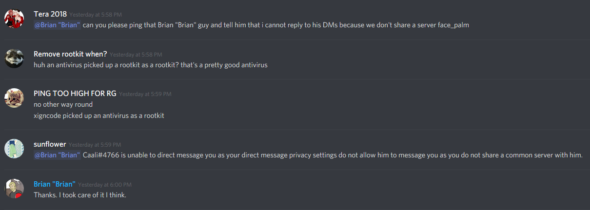
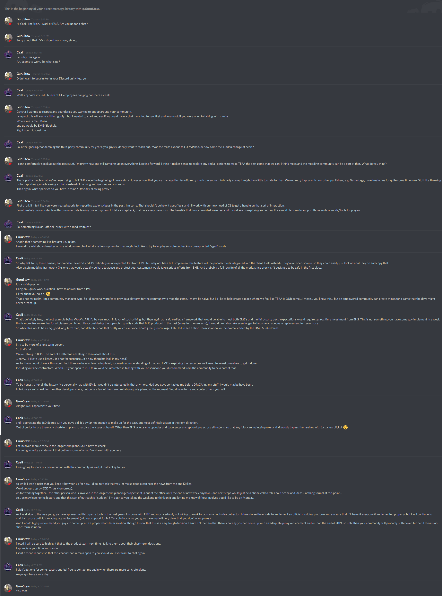

# Regarding EME's 180 degree turn on third-party applications

Let me start with a warning: this is going to be quite a long text. However, I hope that it's worth the read - especially for people torn apart between NA and EU servers right now.

## What happened?
Yesterday, I was pleasantly surprised when I was contacted by Brian "Brian" (no memes here, that's actually his name on Discord), who from what I could gather is quite a new employee at EME.
To give you a tl;dr version: less than two weeks after taking *legal action against me* and other third-party developers, he not only *acknowledged the benefits of tera-proxy* speaking on EME's behalf, but he also *proposed hiring me as an outside contractor* to develop an *official modding platform* for TERA.

As a player following the recent drama, you're probably wtf-ing right now just as much as I did. I have to admit, during our conversation I felt quite some [Schadenfreude](https://en.wikipedia.org/wiki/Schadenfreude). The players' response to the DMCA takedowns (public backlash and drop in player count caused by the mass exodus to EU) must have hurt them pretty badly!

## Agenda
I will start by showing you our entire conversation. Then, I'll critically discuss his proposals and point out what challenges I see in that - don't get me wrong, I don't want to crush your hopes and dreams, but I want to stay realistic and factual. Afterwards, I'll talk about what I think would be the best steps to take now. I'll conclude with a summary of the implications of what happened.

# The conversation
Our conversation started out with a mEME too funny to be true. Brian contacted me in a DM on Discord, asking if I was up for a chat. When I tried to respond, I couldn't - he had DMs disabled and we didn't share a server, since I was banned from EME's Discord. That reminded me of the past two years of trying to communicate with EME in a pretty ironic way...

I had to ask people on my own server (who weren't banned on EME's Discord yet, because let's face it - pretty much everyone is banned there) to ping him, so they did:

After sorting this out, the conversation started. Brian was `typing...` for ages, leading to the conclusion of pedantic proofreading in order to not accidentally cause another publicity disaster.
I had stated that I was done with EME and not up for any kind of communication anymore, even if they were to contact me, in my [open letter](https://pastebin.com/5gSHMkRE) earlier. However, I tried to remain professional and constructive, as I didn't really see any reason not to be (and admittedly, I was quite curious about what he had to say):

*(if you can't read it, right click -> view image)*

# The proposed "official modding platform"
Let me start by saying that I would totally, 100 percent, be in favor of such a platform. I am certain that it would benefit everyone *if done right*. The emphasis on "if done right" is the part that makes me doubt its success, as I will explain in the following.

In order to be an adequate replacement for tera-proxy, an official modding platform would have to fulfill a few very basic criteria:
1. It needs to be safe for the publisher, i.e. it must not facilitate cheating, exploiting, or botting in any way.
2. It needs to be safe for the players, meaning that it must be impossible for mods to access anything outside of the game (files, internet, ...).
3. It needs to provide a feature set similar to that provided by tera-proxy right now (excluding, obviously, any kind of exploit - but those are not tolerated by us proxy developers either).

While they might sound trivial, implementing a solution that fulfills all of these is an *extremely* complex task from a technical standpoint.

In order to be safe for the players (also to make abuse harder), the mods would have to be contained in a very tight sandbox with a clearly defined and restricted interface. If you're downloading a mod for the *official* modding platform, you as a player have to be able to expect that you can trust it to a certain degree, e.g. it will not install a keylogger on your computer or use it to mine cryptocurrency, but at worst cause harm to your ingame character. That level of trust is not to be expected when downloading some third-party software from a random guy on the Internet using Mr. Robot as his profile picture. This is one of the main reasons why pretty much all third-party software is open-source, allowing anyone to inspect mods before installing them. Fulfilling this fundamental requirement is straight out impossible with the current tera-proxy infrastructure, which means that there cannot simply be an official version of it. Everything would need to be rebuilt from scratch.

For the platform to be safe for the publisher, the accessible subset of in-game features needs to be defined and restricted very delicately. As an example, skill-prediction would need access to functionality such as starting skills, controlling your character's animations, and so on in order to function properly. However, the very same functionality could easily be abused for bots or automated rotation helpers. As there's no way for a computer to distinguish between those two, implementing a skill-prediction mod based on such a platform would not be possible. This, in turn, conflicts with requirement 3.

As you have probably already concluded, such a platform would not be something that EME can implement on their own. Anything they could possibly come up with would be a band-aid solution at most. In order to be done right, such a platform has to be tightly integrated into the game client itself by BHS.

A perfect example for the complexity of building such a platform is [World of Warcraft's addon API](https://wow.gamepedia.com/World_of_Warcraft_API). Even Blizzard, a company with undebatably far more resources and a much better track record of preventing cheats in their games than EME and BHS combined, has oftentimes struggled with designing their addon API in a way that satisfies all three requirements that I listed earlier.

Let me give you an example: WoW has a LFG tool similar to TERA's, and world quests (WQs) which are similar to guardian missions. The LFG tool's functionality was fully exposed to addons, meaning that any addon could create or apply for groups. In order to speed up your daily WQ grind, someone developed an addon that would automatically queue you for an appropriate group upon entering a WQ area, or create one if none was found. This addon became so popular that it literally overloaded their servers responsible for LFG matching, and that most groups would be full of people flying to a WQ, auto-joining a group, going afk for a while, and letting others complete the quest for them. Blizzard intervened by changing the API so that it requires some kind of physical input (e.g. from your keyboard or mouse) in order to join or create a group in the LFG tool. To circumvent this restriction, the addon developers adjusted their addon so that it now shows a text box upon joining a WQ area, in which you have to enter the quest-to-be-completed's ID (which the addon conveniently shows as well) as group name - effectively replacing the auto-join by having you enter a few numbers. This lead to the LFG tool being full of groups called `224712`, `301923`, and so on, subsequently making the tool even more annoying for "legitimate" usage. In the end, everyone was pissed - users of the addon and people opposing it - and nothing really changed.

This example from WoW shows how simple modding interface design choices can have a *massive* impact. It occurred fairly recently, when WoW's dev team already had over a decade of experience and development effort with regards to perfectioning their addon interface. Can you possibly imagine the disaster bound to happen when BHS, a company who did not even manage to implement a packet encryption resilient to MITM attacks, attempts to implement something like this?

It has probably also become clear that, if done right, an official modding platform would require a *massive* amount of resource investments from BHS. I'm talking about at least a year's worth of updates here. That's also the minimum required timespan I'd estimate it'd take to properly implement such a huge framework and integrate it into a game client as complex as TERA's, so it would most definitely not be a short-term solution for the proxy drama that pinnacled in the DMCA takedowns. If EME fails to provide a proper workaround while waiting for an official modding platform to be implemented, their playerbase will suffer and consequently shrink even further in the meantime. I will talk about possible short-term approaches later.

# Alternative long-term project proposal
Assuming that EME/BHS are serious about investing such a massive amount of resources into such a huge long-term project, I think that there are more pressing issues at hand than an official modding platform. Again, I'd totally welcome such a thing, but in my opinion there are more urgent long-term projects for BHS to tackle first, namely fixing the performance problems:

## Porting TERA.exe to 64-bit
This is a no-brainer and pretty much a requirement if they want the game to live on for more than a few more years. It's almost 2019, and being limited to less than 3 gigabytes of RAM usable in a video game is simply not feasible anymore. Even World of Warcraft, which is almost a decade older than TERA, entirely dropped support for its 32-bit client in the most recent expansion.

It would certainly take quite some effort to port TERA to 64-bit, but I'd estimate it could be done within a month or two, i.e. the equivalent of one major content patch.

## Rewriting TERA.exe's DataCenter engine from scratch
Without the strict limitations of a 32-bit application, the developers should decide to trade off great reductions in CPU usage in exchange for increased memory usage, by storing the data from the DataCenter file in much, much more efficient data structures. Currently, all data is accessed through string-based look-ups, which is horribly inefficient.

I've experimented around with run-time code patches through DLL injection before, replacing the slow DataCenter look-ups with more efficient ones in *just a few (<10) performance bottleneck hotspots* that I identified by profiling the game client during intensive combat situations (elite guardian mission). In my proof-of-concept, this increased my average FPS from ~30 to ~38 on a mid-tier gaming PC. That's an increase by about 27% and I just improved a few select spots (as binary patching stuff is pretty painful)! I wouldn't be surprised if a full rewrite, with access to the client's source code, would yield improvements of more than 50% in some situations.

I'd estimate this to be much more work than the 64-bit port, but both combined should still be less work than implementing a proper modding platform from scratch.

## Implementing built-in client-side prediction
I think [this Wikipedia article](https://en.wikipedia.org/wiki/Client-side_prediction) as been linked pretty often already. This would be a proper, non-band aid replacement for skill-prediction. TERA urgently needs that.

## Improving the network protocol
It's common knowledge that TERA's network communications protocol is beyond inefficient. Why does `S_SPAWN_NPC` send the internal Korean description string for every single NPC that's spawned on your screen? Why does using regular nocteniums in combat make the server literally DoS-attack you with an insane packet spam?

I am fairly certain that the network traffic during intense combat situations (where performance actually matters) could be reduced by at least 25%, probably even much more than that, when optimizing the protocol. It's not an issue in Korea where everyone has a high-speed internet connection with extremely low latencies, but it is a huge problem when someone from South America with a low-end internet connection is trying to play the game.

While you're at it, implement a proper packet encryption. No client-sided anti-cheat in the world will be able to do *anything* to protect your game if anyone can just reroute the server connection through a second computer/raspberry pi/whatever and just MITM the traffic.

## (Porting to UE4)
No idea about the resources required, the licensing stuff, and the possible gains. Might be worth looking into once the problems listed before have been fixed.

# Short-term improvements
None of the long-term projects that I listed earlier can be implemented by EME. They'd have to pressure BHS into doing so, maybe by allying with other TERA publishers since their users experience the same performance issues.

However, there are quite a few things EME should tackle in the meantime, in order to stop the mass exodus to EU and to regain the trust of their players. I'll take the time to list some of the issues that I've seen players complain about most often. I'll probably forget a bunch, but then again, EME's forum is overflowing with constructive feedback.

## Removing xigncode
This has been talked about again and again. Xigncode does not prevent *any* kind of cheat used in TERA. The only thing it does is alienate customers, and prevent those on non-Windows platforms from playing altogether. Every deliberate attempt at enforcing it to be running (even though it does not prevent anything when running) was bypassed within a few hours.

EME, admit openly that you've been scammed into paying for a useless anti-cheat by Wellbia (expressed using corporate terms, obviously) and sell it to your players as "the players have spoken out against it, so we decided to remove it". I'm certain that this move alone will help appease some of the players' recent anger towards you.

While you're at it, convince BHS to remove it from all other regions as well. It might not be the case for NA TERA, but all asian TERA players are permanently exposed to a [very very serious security vulnerability](https://x86.re/blog/xigncode3-xhunter1.sys-lpe/) caused by xigncode, which can be exploited [with a few lines of code](https://github.com/Psychotropos/xhunter1_privesc). Even worse for you, someone with malicious intent could try to install the vulnerable driver (which has a valid signature!) pretending to be EME's version of TERA, and then exploit it.

## Coming up with an intermediate replacement for skill-prediction and fps-utils
These two mods are by far the most popular ones, and pretty much every single proxy user uses them. Loosing access to these mods due to the proxy DMCA was probably reason number one for players to leave NA and migrate to EU, or just quit the game altogether. Even if EME/BHS manage to implement a proper solution in the long run (as discussed earlier), they still need a short-term fix *urgently* if they want to appease their players and stop the exodus.

The only band-aid fix that I was able to come up with would be officially allowing (or at least tolerating, i.e. giving the third-party devs a legally binding assurance that they will not go after us any further) tera-proxy to be used until an in-house replacement is available, perhaps limited to using only these two modules. We could add more checks to SP, causing it to be permanently disabled in PvP situations, since that's what most people complained about. However, I am not sure if that's even within the realm of possibility for EME, after going all the way to take down proxy. In my opinion, any other solution they can possibly come up with would be better for EME, as long as it's an adequate replacement. Officially allowing/tolerating tera-proxy would certainly piss off the players who are strongly against it. So this is some kind of last resort, but as I said, I was unable to think of any other short-term solution.

## Improving your server infrastructure
Let me make this quick: some players who migrated to EU after the DMCA takedowns reported having the same (sometimes even a better!) ping to Europe which is halfway across the planet, as compared to the NA servers which are a few hundred miles away from them. This needs to change.

## Improving your communication
I think everyone, regardless of in favor of proxy or against it, will agree that EME is totally out of touch with their community. They *really* need to improve that. The DMCA takedowns were just the straw that broke the camel's back, after a years-long track record of fuck-ups. [Here](https://i.imgur.com/o6FaALy.jpg) are [some random screenshots](https://cdn.discordapp.com/attachments/150048025425739777/497268271578611722/Screenshot_20181004-054606_Discord.jpg). This includes not [deleting hundreds of posts containing criticism](https://cdn.discordapp.com/attachments/246174488809570305/497665371885666304/we_are_listening_to_your_feedback.png) and (shadow)banning hundreds of players in your forum and on Discord (including one of your player council members) within less than two weeks.

Contacting me was definitely a step in the right direction. Walk a few hundred miles further and you'll be good. What you definitely need to do now is *keep posting status updates on your development processes regularly*, by that I mean twice a month at least. If you don't, or if they don't contain any interesting news, people will lose interest and lose faith in your sincerity about the promises to change the game for the better.

## Replacing KitTeaCup
I hate to bring it up and please don't get me wrong here, this is absolutely nothing personal. It's just that pretty much every single one of your players agrees that she is totally unfit for her position due to her lack of knowledge about TERA. Just compare [her level of on-stream gameplay](https://www.youtube.com/watch?v=caAh8-8iG9g) to that of [Gameforge employees previewing a new HM dungeon by playing it on stream](https://www.twitch.tv/videos/318705825?t=01h31m39s). She's CM for more than half a year already if I'm correct, so you can definitely expect her to know at least the basics. Maybe hire a second CM who actually plays the game, and find a better suited position for her - perhaps organizing in-game events, doing role-playing events, or something else. I'm sure you can find a better fit. She has literally become a meme in the community, and not in a positive way.

## Improving your region-specific game properties
Many of the players who migrated from NA to EU were pleasantly surprised by the differences in gearing and the cash shop business model. Within the two weeks since the DMCAs, some people who switched publishers have already managed to reach lower-Stormcry enchant levels after leveling their newly created characters to 65.

There's a [really great forum post](https://board.tera.gameforge.com/index.php/Thread/73935-NA-Refugee-s-Guide-to-EU-TERA/?postID=910309#post910309) someone wrote in response to the NA player influx, outlining the regional differences. EME, you might want to look at that and consider your options, especially in regards to talent problem which the community has been begging you to solve for *months*.

## Officially allowing DPS meters
Even if you decide to continue disallowing the use of proxy in any form, you should post an official statement allowing the use of third-party applications that do not modify or interfere with network traffic, e.g. DPS meters. There's literally nothing you can lose by doing so.

## Setting up a public testing server
In order to report exploits, we obviously need to find them first, which implies that we can only report stuff after it has made its way to the live servers. There are exceptions to that, for example we've recently sent a detailed report to GF employees about exploits in the new fishing system based on testing done on the KR servers, but they're rather uncommon.

If you were to install a public, or even a semi-public (i.e. invite-only) test server where people, including us, can test upcoming patches and report bugs/exploits *before* they make it to live, you could spare everyone from trouble. This would not just help you fix exploits earlier, but also expose a lot of bugs found by regular (that is non-developer) players. A lot of games have testing servers, so why not TERA as well?

# Implications & Fallout
Let me just sum up the events of the past weeks for you one more time: **EME**, a company with a track record of being disconnected from their playerbase and their players' feedback, more or less explicitly **offered me**, the devil himself, **a job as an outside contractor merely two weeks after taking legal action against me**, and **acknowledged proxy's benefits** after condemning it as a cheating tool for years. In other words: the community backlash was so bad that they had to swallow their pride and openly admit defeat.

**This is not a good position for a company to be in!** But I guess this is the result of ignoring your players' feedback and denying any kind of communication with knowledgeable developers who want to improve your game for years.

If they had just communicated with the third-party developers instead of DMCA'ing our stuff, none of this would have ever happened and they'd be in a much better position now, in terms of publicity. There would also not be any defeat to admit, only successful cooperation and a better gameplay experience for everyone, since we would have worked on improving the game together for years already. The way they approached the situation was arguably the worst possible one they could have picked - even just ignoring tera-proxy usage (as long as no exploits are involved) would have been better.

And there will be some very bad consequences, not just for EME but also for the other publishers:
1. The whole story is obviously a publicity catastrophe, much worse even than last year's proxy drama. It was picked up by gaming magazines, reddit, and so on. New players who are interested in starting to play TERA on NA servers are being told to play on EU instead, or not start at all.
2. The fanatic anti-proxy players will now probably hate EME and be disappointed, as well. How dare they cave in to those evil third-party hackers who all "deserve to rot in jail" ((c) ElinUsagi)?
3. A lot of players who have already lost their faith in EME will see this decision as some kind of last-minute promise to stop more players from quitting NA. They will probably not take it seriously, considering EME's history. Personally, I have my doubts as well, but we'll have to see if they are actually serious about this.
4. Regardless of what caused EME's change of heart, and even though they might have finally realized that they have to change, a lot of players will stay in EU. After all the time of being disappointed by EME, they were surprised by how much better of a publisher GF is (or maybe will have been, if EME improves?) and it will be hard to convince them to migrate back. *A lot* of players have talked about this.
5. EME pretty much set a precedent for all other publishers. If even EME, a sister-company (afaik) of BHS, openly admits that such a large percentage of their players use third-party tools that they had to cave in *after taking legal action*, then I am pretty sure other publishers will think twice about going after proxy. This is effectively a lifetime "get out of jail free" card for proxy, which is **not** a good thing!

# Conclusion
I hope you're still with me after this wall of text.

Once again, let me emphasize that I was pleasantly surprised by EME suddenly reaching out to me and even proposing an official modding platform, even though I am pretty sure that they were only convinced to do so by force, i.e. a massive drop in player numbers/sales. As you have read in the chat log, I politely declined their offer, because I am personally done with EME after all the shit they've pulled off in the past years. Nevertheless, I'd be glad to see them finally get back on track and become a better publisher again.

Furthermore, as I've written earlier, I would very much welcome an official modding tool (for all regions!). However, I've outlined my concerns about the feasibility of such a project, and listed issues that, in my opinon, should be tackled first. If that has crushed your hopes, I'm sorry :(

I'm sure that everyone will closely follow the development. It would be in EME's very best interest to keep posting status updates often.

Thanks for reading!

*If you are a notable third-party developer and, unlike me, still interested in cooperating with EME, I suppose you can just contact Brian about it.*

